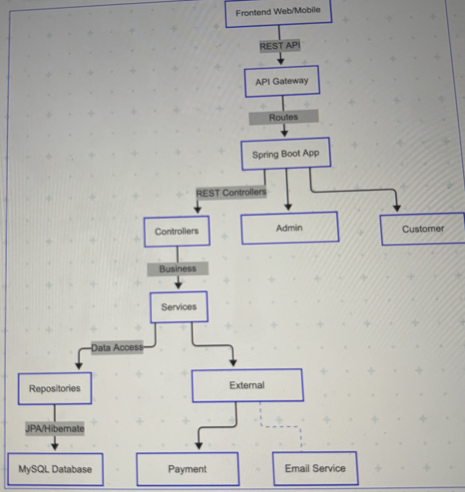

# Grocery Store API


---

## What is this project?

This project is a **Grocery Store API**—the "brain" behind an online grocery store. It keeps track of all the products, categories, customers, and orders—just like a real store, but in a computer!

- **API** stands for Application Programming Interface. It's a way for different programs (like a website or mobile app) to talk to this grocery store "brain" and get or update information.

---

## Who is this for?
- **Developers** who want to build a grocery store website or app.
- **Store owners** who want to manage their inventory and orders digitally.
- **Students** or **beginners** who want to learn how a real-world backend system works.

---

## What can you do with it?
- **See all products** in the store
- **Add new products** (like apples, milk, bread)
- **Organize products** into categories (like Fruits, Dairy, Snacks)
- **Register customers**
- **Place orders** for products
- **Track inventory** (how many items are in stock)
- **See all orders** and their details

---

## How does it work? (Simple Explanation)
1. **You (or your app) send a request** to the API (for example: "Show me all products").
2. **The API talks to the database** to get the information.
3. **The API sends back a response** (for example: a list of all products in the store).

---

## Quick Start

### Prerequisites
- **Java** (the programming language)
- **Maven** (a tool to run Java projects)
- **MySQL** (the database where all the store data is kept)

### Setup Steps
1. **Download or clone this project** from GitHub.
2. **Make sure MySQL is running** on your computer.
3. **Update your username and password** in the file `src/main/resources/application.properties` if needed.
4. **Run the project** with this command:
   ```bash
   mvn spring-boot:run
   ```
5. **Open your web browser** and go to [http://localhost:8080/products](http://localhost:8080/products) to see all products.

## Database Setup

A **database** is a system that stores all your grocery store's information—products, categories, customers, and orders—so your application can access and update them efficiently.

This project uses **MySQL**, a widely-used, free, and reliable database system.

### Step 1: Install MySQL
- Download MySQL from the [official website](https://dev.mysql.com/downloads/installer/).
- Follow the installation instructions for your operating system.
- During installation, set a **root password** and remember it.

### Step 2: Start MySQL
- On Windows: Use MySQL Workbench or the MySQL Command Line Client.
- On Mac: Use MySQL Workbench, or start MySQL from System Preferences or with `brew services start mysql` if installed via Homebrew.

### Step 3: Create the Database (Optional)
The application can create the database automatically, but you can also do it manually:
```sql
CREATE DATABASE IF NOT EXISTS grocery_store
  CHARACTER SET utf8mb4
  COLLATE utf8mb4_unicode_ci;
```

### Step 4: Configure the Application
Edit `src/main/resources/application.properties` to match your MySQL setup:
```properties
spring.datasource.url=jdbc:mysql://localhost:3306/grocery_store?createDatabaseIfNotExist=true
spring.datasource.username=root
spring.datasource.password=YOUR_PASSWORD_HERE
spring.datasource.driver-class-name=com.mysql.cj.jdbc.Driver

spring.jpa.hibernate.ddl-auto=none
spring.jpa.show-sql=true
spring.jpa.properties.hibernate.dialect=org.hibernate.dialect.MySQLDialect
```
Replace `YOUR_PASSWORD_HERE` with your actual MySQL root password.

### Step 5: Let the App Set Up the Tables
When you run the app, it will automatically create all necessary tables (products, categories, customers, etc.) using the `schema.sql` file. No manual table creation is needed.

### Step 6: (Optional) View Your Data
- Open MySQL Workbench and connect to your MySQL server.
- Find the `grocery_store` database in the left sidebar.
- Expand "Tables" to see all tables.
- Run queries like:
  ```sql
  SELECT * FROM products;
  ```

## Project Code Overview

Below is a simple explanation of the main folders and files in your project:

| Path/Folder                          | What it is / What it does                                                                 |
|-------------------------------------- |------------------------------------------------------------------------------------------|
| `src/main/java/com/grocerystore/`     | Main Java source code for your application                                               |
| ├── `controller/`                     | Handles incoming requests (like "show me all products") and sends responses              |
| ├── `model/`                          | Defines what a Product, Category, Customer, etc. look like (the "shapes" of your data)   |
| ├── `repository/`                     | Talks to the database to save, update, or get information                                |
| ├── `config/`                         | Configuration and code that runs when the app starts (like adding sample data)           |
| `src/main/resources/`                 | Configuration files and database setup scripts                                           |
| ├── `application.properties`          | Where you put your database username, password, and other settings                      |
| ├── `schema.sql`                      | SQL script that creates the database tables                                              |
| `pom.xml`                             | The "recipe" for building your project (lists dependencies and plugins)                  |
| `README.md`                           | This documentation file                                                                 |
| `docs/IMG_4486.jpeg`                  | Your architecture diagram image                                                          |

---

### Example: What happens when you visit `/products`?

1. **Controller**: The `ProductController` receives the request.
2. **Service** (if present): Handles business logic (e.g., checks if a product exists).
3. **Repository**: Talks to the database to get the list of products.
4. **Model**: Each product is represented as a `Product` object.
5. **Response**: The controller sends the list of products back to your browser or app.

---

### How does the code connect to the database?

- The `application.properties` file tells the app how to connect to MySQL.
- The `repository` classes use Spring Data JPA to talk to the database.
- The `schema.sql` file sets up the tables the first time you run the app.

---

### Where do I add new features?

- **New API endpoint?** Add a new method in a controller (e.g., `ProductController`).
- **New type of data?** Add a new class in `model/` and a new repository in `repository/`.
- **Change database settings?** Edit `application.properties`.

---

## Architecture Diagram



A full-featured RESTful API for managing a grocery store, built with Java, Spring Boot, JPA, and MySQL. This project demonstrates entity relationships, CRUD operations, and RESTful design.

## What are the main parts?
- **Frontend**: The website or app people use.
- **API**: The "brain" that handles requests and talks to the database.
- **Database**: Where all the information is stored (like a digital filing cabinet).

---

<<<<<<< HEAD
## Features
- Manage Products, Categories, Customers, Orders, and Order Items
- Full CRUD operations for all entities
- Entity relationships (One-to-Many, Many-to-One)
- MySQL database for persistent storage
- Clean, professional code structure

## Tech Stack
- Java 17
- Spring Boot 3
- Spring Data JPA
- MySQL
- Maven

## Getting Started

### Prerequisites
- Java 17+
- Maven
- MySQL Server (running on localhost:3306)

### Database Setup
1. Create a database named `grocery_store`.
2. Update your MySQL username and password in `src/main/resources/application.properties` if needed.
3. The schema and sample data will be initialized automatically from `src/main/resources/schema.sql` and the DataInitializer class.

### Running the Application
```bash
mvn spring-boot:run
```
The API will be available at `http://localhost:8080`.

## API Endpoints
=======
## API Endpoints (What can you ask the API to do?)
>>>>>>> 5cf1cfa (Add professional, beginner-friendly Database Setup section)

### Products
- `GET    /products`         - List all products
- `GET    /products/{id}`    - Get product by ID
- `POST   /products`         - Create a new product
- `PUT    /products/{id}`    - Update a product
- `DELETE /products/{id}`    - Delete a product

### Categories
- `GET    /categories`         - List all categories
- `GET    /categories/{id}`    - Get category by ID
- `POST   /categories`         - Create a new category
- `PUT    /categories/{id}`    - Update a category
- `DELETE /categories/{id}`    - Delete a category

### Customers
- `GET    /customers`
- `GET    /customers/{id}`
- `POST   /customers`
- `PUT    /customers/{id}`
- `DELETE /customers/{id}`

### Orders
- `GET    /orders`
- `GET    /orders/{id}`
- `POST   /orders`
- `PUT    /orders/{id}`
- `DELETE /orders/{id}`

### Order Items
- `GET    /order-items`
- `GET    /order-items/{id}`
- `POST   /order-items`
- `PUT    /order-items/{id}`
- `DELETE /order-items/{id}`

---

## What are some example requests?

- **See all products**:  
  [http://localhost:8080/products](http://localhost:8080/products)

- **See all categories**:  
  [http://localhost:8080/categories](http://localhost:8080/categories)

- **Add a new product** (using a tool like Postman or curl):
  ```bash
  curl -X POST http://localhost:8080/products \
    -H 'Content-Type: application/json' \
    -d '{"name": "Milk", "price": 2.49, "description": "Fresh milk", "category": {"id": 1}, "stockQuantity": 100}'
  ```

---

## What does a response look like?

```json
[
  {
    "id": 1,
    "name": "Milk",
    "price": 2.49,
    "description": "Fresh milk",
    "category": {
      "id": 1,
      "name": "Dairy"
    },
    "stockQuantity": 100
  }
]
```

---

## What if something goes wrong?

- If you ask for something that doesn't exist, you'll get an error like this:
  ```json
  {
    "timestamp": "2025-06-08T03:03:58.679+00:00",
    "status": 404,
    "error": "Not Found",
    "path": "/categories/999"
  }
  ```

---

## How is the project organized?

- **controller/**: Handles requests from the website or app.
- **model/**: Defines what a product, category, customer, etc. look like.
- **repository/**: Talks to the database.
- **config/**: Setup and sample data.
- **resources/**: Configuration files and the database setup script.

---

## Can I help or ask questions?

Absolutely!  
- You can suggest improvements or ask questions by opening an issue on GitHub.
- Or email: vardhaninturi@gmail.com

---

## License

MIT — you can use this code for free, even in commercial projects.

<<<<<<< HEAD
For questions or support, open an issue or contact khyathivardhan18@gmail.com.
=======
---
>>>>>>> 5cf1cfa (Add professional, beginner-friendly Database Setup section)

## Sample application.properties for MySQL
```properties
spring.datasource.url=jdbc:mysql://localhost:3306/grocery_store?createDatabaseIfNotExist=true
spring.datasource.username=root
spring.datasource.password=anilkumar123
spring.datasource.driver-class-name=com.mysql.cj.jdbc.Driver

spring.jpa.hibernate.ddl-auto=none
spring.jpa.show-sql=true
spring.jpa.properties.hibernate.dialect=org.hibernate.dialect.MySQLDialect
``` 
